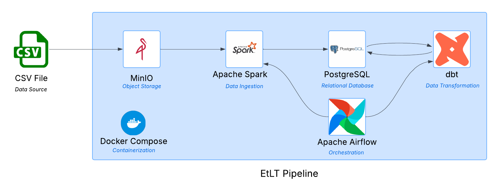

# ETLT Pipeline - Flight Data 2024



An end-to-end ETLT (Extract, Transform, Load, Transform) pipeline processing 7 million rows of US flight data from 2024.

## Architecture

- **Storage**: MinIO (S3-compatible object storage)
- **Ingestion & Transformation**: Apache Spark
- **Database**: PostgreSQL
- **Data Modeling**: dbt
- **Orchestration**: Apache Airflow

## Pipeline Overview

1. Raw CSV data is stored in MinIO
2. Spark reads the data, cleans and transforms it, and loads it into PostgreSQL (`sch_cleaned_data.silver_table`)
3. dbt builds gold layer models on top of the silver table
4. Spark and dbt tasks are orchestrated by Apache Airflow

## dbt Models

**Intermediate tables**

- `top5_airports_flights` — filters flights from the 5 busiest airports

**Gold tables**

- `flights_late_binary` — adds a binary flag for delayed departures
- `top_airports` — counts flights per airport (origin & destination)
- `avg_delay_per_airline` — average departure delay per airline
- `best_airline_per_airport` — airline with lowest average delay at each of the top 5 airports

## Setup

### Requirements

- Docker + Docker Compose

### Steps

1. Clone the repo:

```bash
git clone https://github.com/wb73-eu/etlt-pipeline.git
cd etlt-pipeline
```

2. Run the run script:

```bash
./run.sh
```

3. Download the dataset from [Kaggle - Flight Data 2024](https://www.kaggle.com/datasets/hrishitpatil/flight-data-2024) and upload it to MinIO:
   - Open MinIO at `http://localhost:9001` (credentials: `minio` / `secretpassword`)
   - Create a bucket named `bucket`
   - Upload `flight_data_2024.csv` to the bucket

4. Open Airflow at `http://localhost:8080` (credentials: `airflow` / `airflow`), enable and trigger your DAG.